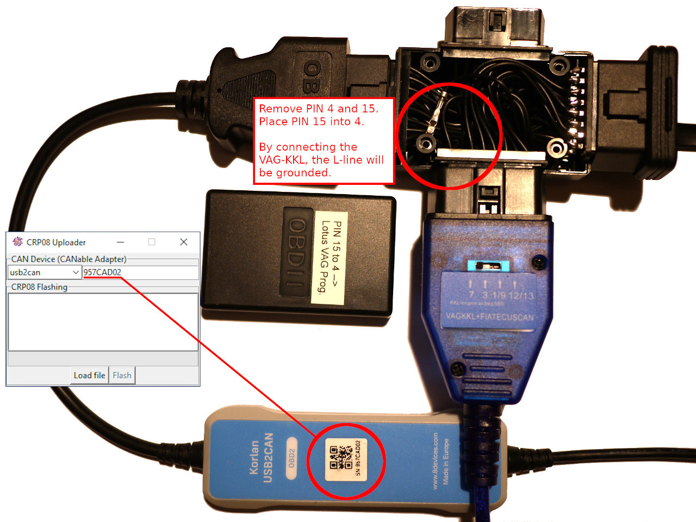
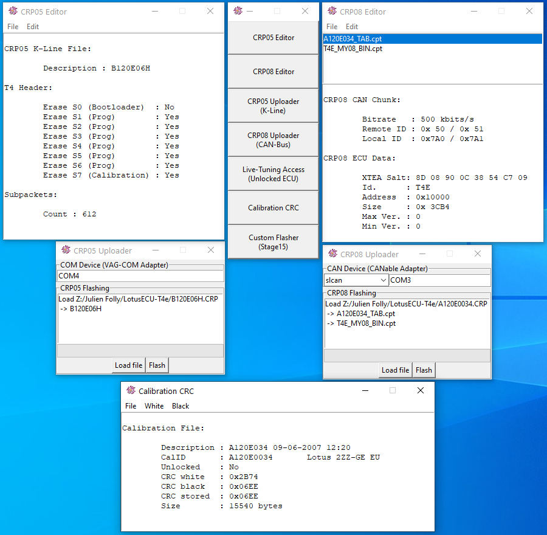
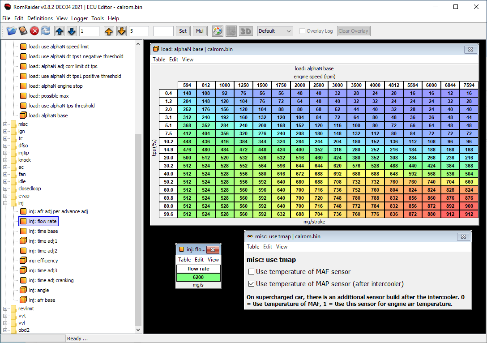
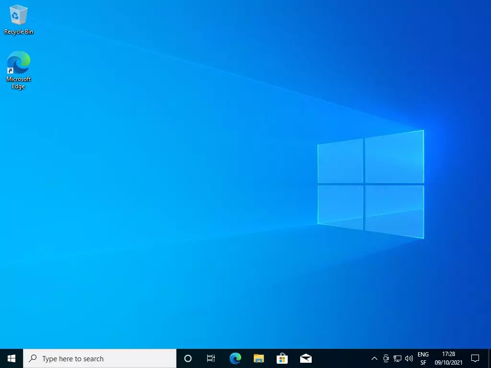
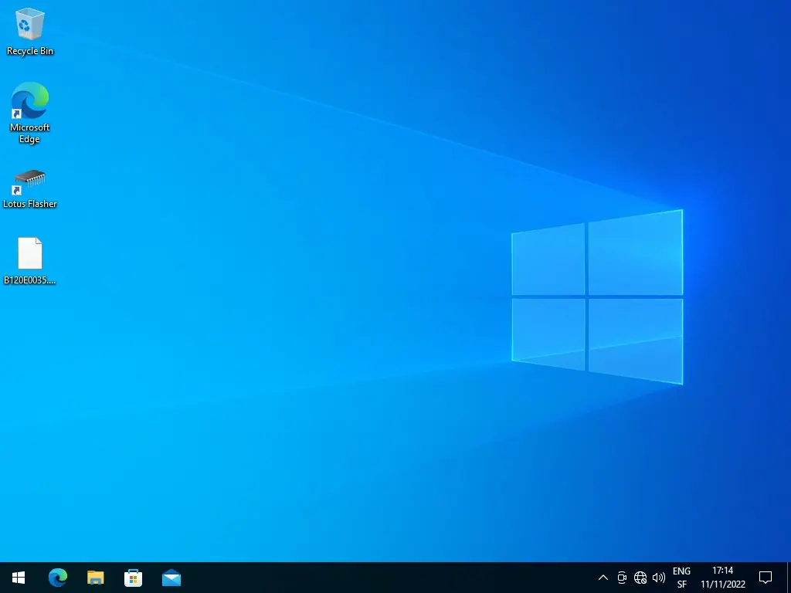
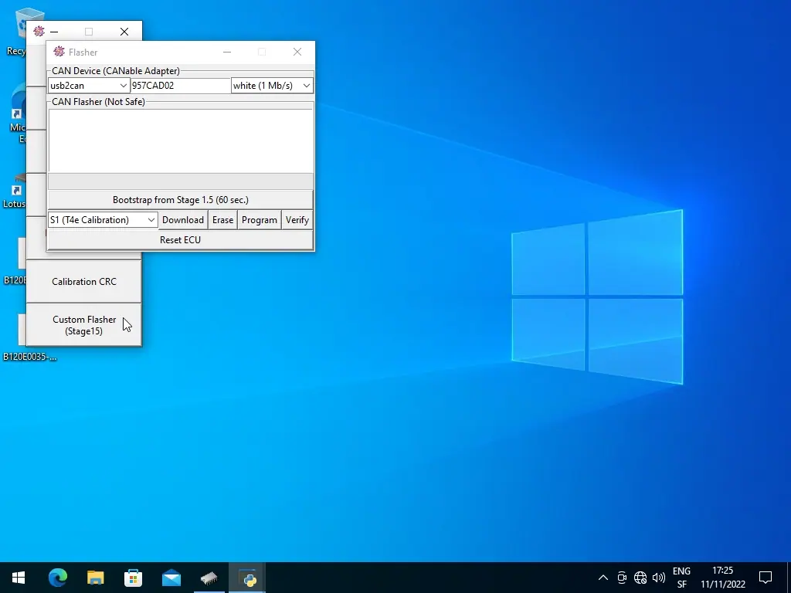

# Lotus K4/T4/T4e/T6/CT1 Flasher

## Disclaimer

***Use it at your own RISK.***

## Introduction

These tools have evolved significantly. Initially, they were merely scripts for
dumping the memory content of my car (Lotus Exige S2). Now, they have the
capability to flash nearly all recents Lotus ECUs.

The work of [Obeisance] and [Cybernet] has greatly assisted me in understanding
how the ECU functions. It saddens me that their work has not found widespread
application, perhaps due to its complexity for those less inclined towards
computing. I strive to make my approach more user-friendly without sacrificing
too much time.

[Obeisance]: https://www.lotustalk.com/threads/daft-disassembly.352193/
[Cybernet]: https://www.lotustalk.com/threads/t4e-ecu-editor-preview.372258/

### Adapters

Initially, I had a USB-to-CAN Adapter but lacked a J2534 adapter. If I were to
start over, I might consider the J2534 adapter, but for now, I will stick with
my cables.

For those wishing to flash a car with a J2534 adapter,
the [EFI Pseudo Programmer] could prove useful.

[EFI Pseudo Programmer]: https://efitechnology.eu/efi/?page_id=822

### The flasher

My car came unlocked from the factory, so I quickly learned how to write to the
RAM long before I could flash my ECU using the Factory Method described below.

So at the beginning, I misused the live tuning access to inject another program.
This program, known as the flasher, enabled me to flash the entire flash with
plain binary data through the OBD Port and CAN-Bus.

Now this flasher is a bit outdated and flashing a car with a CRP file is probably
the way to go, but it's still have some advantages over the factory method:

 - Works faster with CAN-Bus on older K-Line cars.
 - Capable of flashing the bootloader to convert T4e ECUs.
 - Useful to read older locked cars.
 - Access to the EEPROM.

### Conversion to black dash

Since 2008, the CAN-Bus has been used for the OBD interface, providing better
and faster data logging.

Therefore, I decided to convert my car by replacing the white cluster with
a black one. I purchased one in miles and needed to display kilometers.
Refer to the folder [cluster-black].

[cluster-black]: documentation/Hardware/Cluster-Black/

### Patching

I've implemented various patches to fulfill my needs.

The flasher has been integrated into the bootloader for added convenience.
Refer to the folder [stage15].

My accusump is now controlled by the T4e ECU. Refer to the folder [accusump].

Oil temperature, pressure, and wideband lambda readings are available on the OBD
interface. Refer to the folders [obdoil] and [wideband].

Last but not least, the flexfuel patch. This enhances the car's performance
by enabling the use of ethanol, providing real horse power!
Refer to the folder [flexfuel].

[stage15]: patch/t4e/stage15/
[accusump]: patch/t4e/accusump/
[obdoil]: patch/t4e/obdoil/
[wideband]: patch/t4e/wideband/
[flexfuel]: patch/t4e/flexfuel/

These patches are intended as code snippets.
For ready-to-use solutions, please contact me.

### Definitions

For those looking to tune their car with a maps editor, a definition file is
necessary.

I've spent hundreds of hours creating definition files.
The file for the 2008 T4e ECU is available in the folder [romraider-defs].

For other cars, please reach out to me.

[romraider-defs]: romraider-defs/

### Documentation

I've compiled a vast amount of documentation, containing everything necessary to
accomplish this task. Processor manuals may not be of interest, unless you
plan to undertake some reverse engineering work. However, the [T4e pinouts], 
the [T6 pinouts] and [Lotus OBD] codes could prove to be quite useful.

[T4e pinouts]: documentation/Hardware/T4e/Board/pinout.ods
[T6 pinouts]: documentation/Hardware/T6/Board/pinout.ods
[Lotus OBD]: documentation/OBD/Lotus%20OBD%20Codes/

## Licensing

Under [CC-NC-SA].
You may not use this material for commercial purposes without my approval.

[CC-NC-SA]: https://creativecommons.org/licenses/by-nc-sa/4.0/

Commercial rights lisenced to [Phil's Targed Tuning],
[FRS performance engineering] and [VF Tuner].

[Phil's Targed Tuning]: https://targedtuning.ch
[FRS performance engineering]: https://www.fujiirs.com
[VF Tuner]: https://vftuner.com/

## Factory Method

### CRP Files

ECU Updates from Lotus are .CRP files, with some available on the [VSIC]. Most
of them are shipped with the Lotus TechCentre or Lotus Scan 3.

It's important to note that the structure of the .CRP files underwent a complete
change in 2008.

[VSIC]: https://vsic.lotuscars.com/

### Pre 2008

The T4 and the T4e ECUs on Lotus vehicles equipped with white dashboards
(Instrument Cluster) have a bootloader split into 2 parts: Stage 1 and Stage 2.

Stage 1 can update Stage 2 and is enabled only if the CRC of Stage 2 is incorrect.

Stage 2 accepts an encrypted .CRP file and can update itself, the calibration,
or the software. It only allows writing via K-Line, with no reading capability.

Destination addresses are not verified, making it possible to write a program to
the RAM and take control by poisoning the stack. Therefore, reading is
indirectly possible.

### Post 2008

The T4e/T6 ECUs found in black dashboard cars feature a different bootloader
compared to those with white dashboards.

This bootloader employs CAN-Bus (500 kbit/s) for reprogramming, accepts an
encrypted .CRP file and can update the calibration, software, or EEPROM.
It only allows writing via CAN-Bus, with no reading capability.

Destination addresses are verified, eliminating the possibility of writing to
the RAM. In the case of T6, destination addresses are replaced by a number.

## Locked or Unlocked ECU ?

I'm using this term to describe whether the ECU has enabled live tuning access.

If the ECU is unlocked, it allows reading and writing of any values in the main
CPU memory space through this live tuning access feature.

Since the maps are copied into the RAM at startup, it becomes possible to edit
the maps while the engine is running.

Most of the white dashboard cars are unlocked, but this access has been
definitively locked on the black dashboard version.

It's possible to re-enable it with a JTAG/BDM access or a modified .CRP file.

Some recent T6 software versions limit access to the RAM only and display the
calibration version on the instrument cluster.

## Prerequisite

The [Python 3] interpreter with the [pyserial] module, the [python-can] module
and a compatible [CAN-BUS adapter].

For the K4, T4 and locked T4e white dashboard, a K-Line adapter is also needed.
To enter the bootlooder with the VAG-COM adapter, the L-line must be grounded.

The [Korlan USB2CAN] is a very good cable. It's just a little
bit more complicated to install it (it requires additional module and a DLL).

The [CANable] (with slcan firmware) is straightforward to use, but I've
encountered some packet loss issues. This is likely due to a firmware bug that
occurs when a large amount of data is being transferred.

The [CANable] (with CandleLight firmware) is better, but it necessitates the use
of another version of python-can (gs_usb).

The [CANable 2.5] firmware makes the CANable adapter very reliable, so it’s
becoming a good option.

The [IXXAT] USB-to-CAN Adapter is easy to use and reliable but expensive.

The Raspberry-Pi + CAN-Hat is cheap and you can use it as a BDM-Programmer, but
it's not really reliable. The MCP2515 has only two receive buffers and the linux
driver for it doesn't implement HW-Filtering ([patch] ?). This leads to packet
loss, especially for old versions (Like V0078, V0080) of the white dash (1 Mbit/s).
Old version of the ECU firmware loads the CAN-Bus at 100% with data for the cluster,
so HW-Filtering would be a big improvement!

[Python 3]: https://www.python.org/download/releases/3.0/
[pyserial]: https://pyserial.readthedocs.io/en/latest/pyserial.html
[python-can]: https://python-can.readthedocs.io/en/stable/
[CAN-BUS adapter]: https://python-can.readthedocs.io/en/stable/interfaces.html
[Korlan USB2CAN]: https://www.8devices.com/products/usb2can_korlan
[CANable]: https://canable.io/
[CANable 2.5]: https://github.com/Elmue/CANable-2.5-firmware-Slcan-and-Candlelight
[IXXAT]: https://www.ixxat.com/products/products-industrial/can-interfaces/usb-can-interfaces/usb-to-can-v2-professional
[patch]: https://github.com/craigpeacock/mcp251x

The cable, I use:

***Note***: You do not need a such complicated cable if you have an unlocked ECU
or a 2008+ car. You would only need the CAN-Bus part.

## GUI

[Command line examples] are in the documentation folder.

[Command line examples]: documentation/Usage/cmd-examples.md

## RomRaider

You have to open the "calrom.bin" file of your dump.

## Safe Usage

It's crucial to understand that the memory of the ECU is divided into
three parts: The bootloader, the calibration, and the program.

If the bootloader is erased, you will have no other choice but to open the ECU
to flash it again.

The live tuning access is facilitated by the main program. Therefore, if you use
this access to flash the ECU, think twice before erasing the program.

The ECU appears to boot fine without a valid calibration, so erasing this part
is relatively safe. However, the car won't run in this case.

## Security checks (DTC P0340 or P0341)

I've encountered numerous times that a freshly programmed ECU throws this error.
The engine starts, runs for 1 or 2 seconds and die, then an OBD scanner reports
the P0340 error.

In the T4e, the car model is stored in the EEPROM at 0x7C0. If you flash another
tune, the ECU will detect it and set a flag. To address this, I recommend filling
the EEPROM from 0x7C0 to 0x7E0 with zeros, as an unprogrammed ECU would be.

In the T6, the car model is stored in the coding area from 0x01C020 to 0x01C040

## Updating the safety CPU (DTC P2107)

For the safety of the drive-by-wire throttle a second processor is involved.

The T4e bootloader will update this processor if the following conditions are met:

 - String "HC08CODE" at 0x021FE0
 - Value 0xAAAAAAAA at 0x021FE8
 - Pointer to 9kb firmware at 0x021FEC

Once the update is successfully completed, the 0xAAAAAAAA will be changed to
0x22222222. The process is very similar for the T6 ECU, but at address 0x040080.

## The Lotus ECU in other cars

### The Caterham Seven

The bootloader uses another encryption key and the unlock magic word differs.
However, the rest is very similar.

### The Yaris GRMN

The bootloader uses another encryption key and communicates using the other
CAN-Bus (PIN RH3 and RH4) at 500 kbit/s.

The live tuning feature is configured on the same interface but at 1 Mbit/s.

The unlock magic word still involves 4 bytes, but they are spread throughout the
calibration and not contiguous at the end.

The CRC algorithm is altered to produces non-standard values and is stored in
the middle of the calibration.

## Need more help?

### Installation

Setup example on Windows:

For the Korlan adapter, run "python -m pip install pywin32", install the
[Korlan Driver] and copy the [CANAL DLL] into your python installation directory.

[Korlan Driver]: http://www.8devices.com/media/products/usb2can_korlan/downloads/usb2can_winusb.msi
[CANAL DLL]: http://www.8devices.com/media/products/usb2can_korlan/downloads/usb2can_canal_v2.0.0.zip

### Flash a white T4/T4e ECU (2001-2008)

It's the factory method described above.

### Dump a locked white T4e ECU (2006-2008)

Locked ECU have only an update access, so a handcrafted CRP file is uploaded.
This special CRP file won't modify your ECU, but will make it crash in a way to
take control of it. Once the control is taken reading is possible.

Both cables are connected to the OBD connector of the car using a Y splitter.

### Unlock an original CRP file

Unpack a CRP file, unlock the calibration and finally repack it. Always check
the CRC before modifying anything, to make sure everything is OK.

The tuning of the calibration is also possible before repacking the CRP.

### Flashing a 2006-2007 T4e ECU with a 2008-2011 software.

Choose a software that match your car (Supercharged, Injector size, ...).

Follow the example "Unlock an original CRP file", to get the unlocked
"XXXXXXXX_TAB.cpt" and "T4E_MY08_BIN.cpt" files. It's also possible to use the
"calrom.bin" and "prog.bin" files from another ECU.

Then follow the example "Dump a locked white T4e ECU (2006-2007)" to get into
the ECU. If you have a unlocked ECU, you can use a shortcut and use the function
"Inject T4e Custom Flasher Program" instead (No VAG-COM adapter needed).

Make a complete backup of your ECU ("calrom.bin", "prog.bin", and "bootldr.bin").

Flash the ECU, using the "Erase", "Program" and "Verify" functions:

***Note 1***: The bootloader of the 2006 is not the same as the 2008 one. But it
can start the 2008 software without any problem (Same entry point in "prog.bin").

***Note 2***: Turning the key off, does not shutdown the ECU when using the
"Flasher". Use the "Reset ECU" function, or disconnect the battery.

***Note 3***: Without modifications the 2008 software is not compatible with a
white instrument cluster!

### The poor man's live-tuning

The Live Tuning allows you to test quickly modifications on a running engine.
I misuse RomRaider for this purpose, hence the name of "The poor man's live-tuning".

In the below example, the idling speed is adjusted with the engine running!

All changes are temporary (only in RAM) and go lost when you turn off the ECU.

### The tuner tool

With standard OBD tools, where you can configure custom Lotus PIDs, and by using
the “Poor Man’s Live-Tuning” feature, you can already achieve a great deal.

However, during a dyno session you are naturally tempted to do steady-state
tuning. What really annoyed me with RomRaider was that, even though I could
change values on the fly, it was never clear which cell the ECU was actually
using at that moment.

So I decided to write a small application to edit the key tables you would
typically tune on a dyno day, this time with a live cursor showing which cells
are currently being used by the ECU.

What a pleasure it is to simply add ignition timing by pressing a key on my
laptop...

***Note 1***: What you see here is a 2008 Lotus Exige on a parking lot, with me
giving it a few revs. This can be implemented for any recent Lotus car, but
because each ECU software version uses different memory locations, it must be
defined individually for each one.

***Note 2***: No wideband sensor was connected during this recording, which is
why the measured AFR incorrectly shows a constant value of 10.

***Note 3***: There is a dedicated ignition table used while the car is idling.
When the accelerator pedal is not pressed, the ignition values in use do not
match the cell indicated by the cursor, this is expected behavior.

***Note 4***: Sorry for the lack of sound, the engine noise completely saturated
my laptop’s microphone.

## Contact

My email is my nickname at hotmail dot com.

