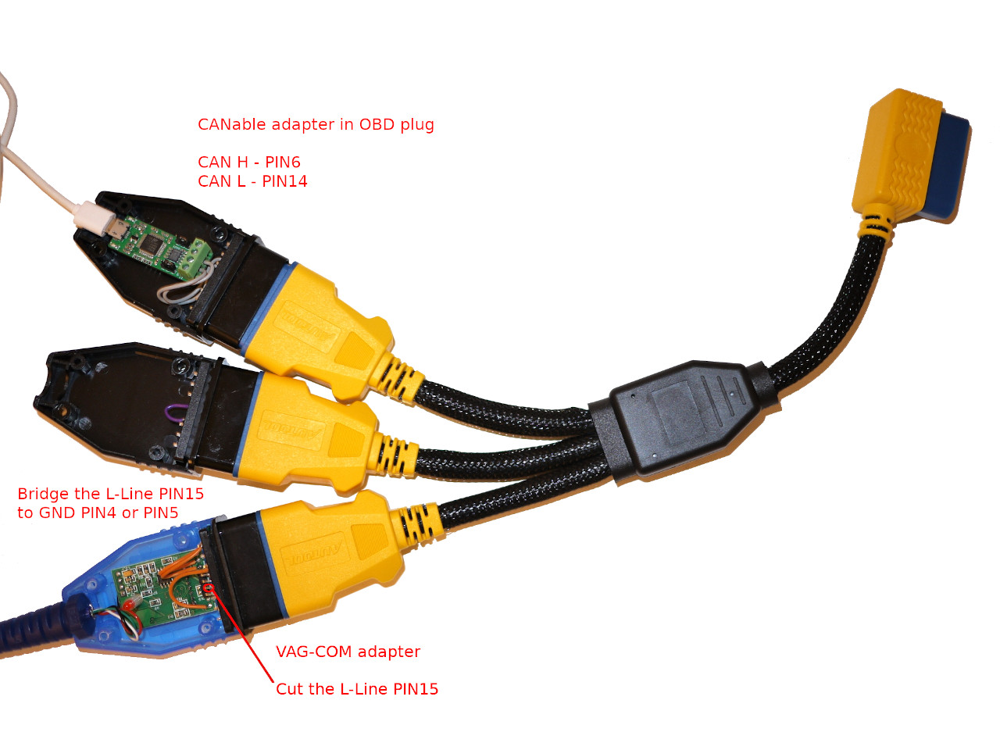

# Lotus T4/T4e/T6 Flasher

## Disclaimer

***Use it at your own RISK.***

## Introduction

This is my attempt to tune my Lotus Exige S2 (T4e ECU White Dash).

It's based on the work of [Obeisance] and [Cybernet].

[Obeisance]: https://www.lotustalk.com/threads/daft-disassembly.352193/
[Cybernet]: https://www.lotustalk.com/threads/t4e-ecu-editor-preview.372258/

I didn't have a Arduino with a CAN-Shield but I have an USB-to-CAN Adapter.
So I made my own Python-Script (Linux and Windows) to make the dump. It should
also work with a RaspberryPi and a CAN Hat (SocketCAN Driver).

After that I've realized that the Calibration ROM located at 0x10000 looks like
identical to the T4 ECU at address 0x70000. So I've edited the [XML] to use the
new offset.

But how to upload the modification back? Hum, after somes hours of disassembling,
I've figured out how to write to the RAM but not to the Flash.

Well If I can write to the RAM, I'am allowed to upload my own program. That's
what I've done. So I've write a small CAN-Bus Flasher to write to the Flash
through the OBD Port.

My final goal was to control my accusump with the T4e ECU, that was not possible
without patching the main program. See folder [accusump].

To be able to patch the main program more safely I've included the flasher into
the bootloader. See folder [stage15].

After that I went a little further by looking at the ECU Black Dash and the T4.
I finally found how to normally flash the ECU, with the needed encryption.

The T4e [XML] definition came recently to cover more features (injector size,
traction control, drive-by-wire, ...).

In my big plan, I want to replace my white cluster by a black one. I've buyed
one in miles and I needed to display kilometers. See folder [cluster-black].

[XML]: romraider-defs/
[accusump]: patch/t4e/accusump/
[stage15]: patch/t4e/stage15/
[cluster-black]: documentation/Hardware/Cluster-Black/

## Licensing

Under [CC-NC-SA]. You may not use this material for commercial purposes.

[CC-NC-SA]: https://creativecommons.org/licenses/by-nc-sa/4.0/

## Factory Method 

### Pre 2008

The T4 and the T4e ECU on the Lotus with white dashboard (Instrument Cluster)
has a bootloader split into 2 parts: Stage 1 and 2.

The stage 1 can update the stage 2 and is enabled only if the CRC of the stage 2
is wrong.

The stage 2 accepts an encrypted .CRP file and can update itself, the
calibration or the software. Only writing with K-Line, no reading...

Destination addresses are NOT verified, so it's possible to write a program to
the RAM and take the control by poisoning the stack. So reading is indirectly
possible.

### Post 2008

The T4e/T6 of the black dashboard cars has another bootloader which does the
reprogramming with CAN-Bus (500 kbit/s).

This bootloader accepts an encrypted .CRP file and can update the calibration,
the software or the EEPROM. Only writing with CAN-Bus, no reading...

Destination addresses are verified. So there is no possibilities to write the
RAM. (T6: Destination addresses are replaced by a number).

### CRP Files

ECU Updates from Lotus are .CRP files. Somes are available on the [VSIC].
Most of them are included in the Lotus TechCentre or Lotus Scan 3.

The structure of the .CRP files has completely change in 2008.

[VSIC]: https://vsic.lotuscars.com/

## Live tuning access [2005-2008]

For most of the white dashboard, there is an access provided by the main program
trough CAN-BUS (1 Mbit/s). It's intended for "live tuning" and not for
reprogramming the ECU, but with somes hacks it could be use for this purpose.

This access has been definitively locked on the black dashboard. But it's
possible to re-enable it, with a BDM access or a modified .CRP file.

## Prerequisite

The [Python 3] interpreter with the [python-can] module and a compatible [CAN-BUS adapter].

The [Macchina P1] should be able to do everything. Have you tried it?
If yes, tell me if it works.

For the T4 and locked T4e white dashboard, a K-Line adapter is also needed.
To enter the bootlooder with the VAG-COM adapter, the L-line must be grounded.

The [Korlan USB2CAN] is a very good cable and I recommend it. It's just a little
bit more complicated to install it (it requires additional module and a DLL).

The [CANable] (with slcan firmware) is very simple to use, but it has a bottleneck
with the serial interface, and does not work well with the "ltacc.py" script.
In contrario the "flasher.py" works flawless (but slowly) with this adapter
because it doesn't make bulk read/write. So if you still want to use this adapter,
use the download function of the "flasher.py" and not from the "ltacc.py".

The [CANable] (with CandleLight firmware) is great but unsupported under Windows yet.
This could change in a near future (see develop of python-can).

The [IXXAT] USB-to-CAN Adapter is easy to use and reliable but expensive.

The Raspberry-Pi + CAN-Hat is cheap and you can use it as a BDM-Programmer, but
it's not really reliable. The MCP2515 has only two receive buffers and the linux
driver for it doesn't implement HW-Filtering ([patch] ?). This leads to packet
loss, especially for old versions (Like V0078, V0080) of the white dash (1 Mbit/s).
Old version of the ECU firmware loads the CAN-Bus at 100% with data for the cluster,
so HW-Filtering would be a big improvement!

[Python 3]: https://www.python.org/download/releases/3.0/
[python-can]: https://python-can.readthedocs.io/en/master/installation.html
[CAN-BUS adapter]: https://python-can.readthedocs.io/en/master/interfaces.html
[Macchina P1]: https://www.macchina.cc/catalog/p1-boards/p1-under-dash
[Korlan USB2CAN]: https://www.8devices.com/products/usb2can_korlan
[CANable]: https://canable.io/
[IXXAT]: https://www.ixxat.com/products/products-industrial/can-interfaces/usb-can-interfaces/usb-to-can-v2-professional
[patch]: https://github.com/craigpeacock/mcp251x

The cable, I use:

Another version:

***Note***: You do not need a such complicated cable if you have an unlocked ECU
or a 2008+ car. You would only need the CAN-Bus part.

## GUI

[Command line examples] are in the documentation folder.

[Command line examples]: documentation/Usage/cmd-examples.md

## RomRaider

You have to open the "calrom.bin" file of your dump.

## Live tuning.

It's possible to make modifications on running engine for test, because the
maps are copied into the RAM.

The poor man's live-tuning provide a limited way of doing it with RomRaider and
an unlocked ECU.

## Safe Usage

You really need to understand that the memory of the ECU is splitted into 3
parts: The bootloader, the calibration and the program.

If the bootloader is erased, you will have no other choice than open the ECU to
flash it again.

The "live tuning" access is provided by the main program. So if use this access
to flash the ECU, think twice before erasing the program.

The ECU seems fine to boot without a valid calibration, so erasing this part is
quite safe. Of course the car won't run in this case.

## The infamous P0340 Camshaft Position Sensor BUG

I've encountered numerous times that a freshly programmed ECU throws this error.
The engine starts, runs for 1 or 2 seconds and die, then an OBD scanner reports
the P0340 error.

In the T4e the car model is stored into the EEPROM at 0x7C0, and if you flash
another tune, the ECU will see it and set a flag. I recommend to fill with zeros
the EEPROM from 0x7C0 to 0x7E0 as an unprogrammed ECU would be.

In the T6 the car model is stored into the coding area from 0x01C020 to 0x01C040.

## Need more help?

### Installation

Setup example on Windows:

For the Korlan adapter, run "python -m pip install pywin32", install the
[Korlan Driver] and copy the [CANAL DLL] into your python installation directory.

[Korlan Driver]: http://www.8devices.com/media/products/usb2can_korlan/downloads/usb2can_winusb.msi
[CANAL DLL]: http://www.8devices.com/media/products/usb2can_korlan/downloads/usb2can_canal_v2.0.0.zip

### Flash a white T4/T4e ECU (2005-2008)

It's the factory method described above.

### Dump a locked white T4e ECU (2006-2008)

Locked ECU have only an update access, so a handcrafted CRP file is uploaded.
This special CRP file won't modify your ECU, but will make it crash in a way to
take control of it. Once the control is taken reading is possible.

Both cables are connected to the OBD connector of the car using a Y splitter.

### Unlock an original CRP file

Unpack a CRP file, unlock the calibration and finally repack it. Always check
the CRC before modifying anything, to make sure everything is OK.

The tuning of the calibration is also possible before repacking the CRP.

### Flashing a 2006-2007 T4e ECU with a 2008-2011 software.

Choose a software that match your car (Supercharged, Injector size, ...).

Follow the example "Unlock an original CRP file", to get the unlocked
"XXXXXXXX_TAB.cpt" and "T4E_MY08_BIN.cpt" files. It's also possible to use the
"calrom.bin" and "prog.bin" files from another ECU.

Then follow the example "Dump a locked white T4e ECU (2006-2007)" to get into
the ECU. If you have a unlocked ECU, you can use a shortcut and use the function
"Inject T4e Custom Flasher Program" instead (No VAG-COM adapter needed).

Make a complete backup of your ECU ("calrom.bin", "prog.bin", and "bootldr.bin").

Flash the ECU, using the "Erase", "Program" and "Verify" functions:

***Note 1***: The bootloader of the 2006 is not the same as the 2008 one. But it
can start the 2008 software without any problem (Same entry point in "prog.bin").

***Note 2***: Turning the key off, does not shutdown the ECU when using the
"Flasher". Use the "Reset ECU" function, or disconnect the battery.

***Note 3***: Without modifications the 2008 software is not compatible with a
white instrument cluster!

### The poor man's live-tuning

The Live Tuning allows you to test quickly modifications on a running engine.
I misuse RomRaider for this purpose, hence the name of "The poor man's live-tuning".

In the below example, the idling speed is adjusted with the engine running!

All changes are temporary (only in RAM) and go lost when you turn off the ECU.

