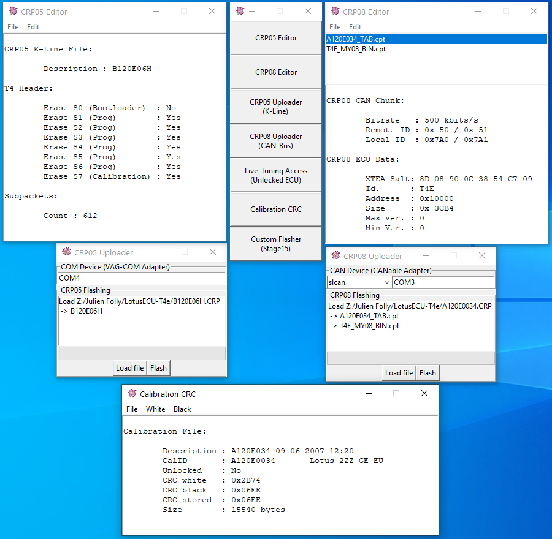
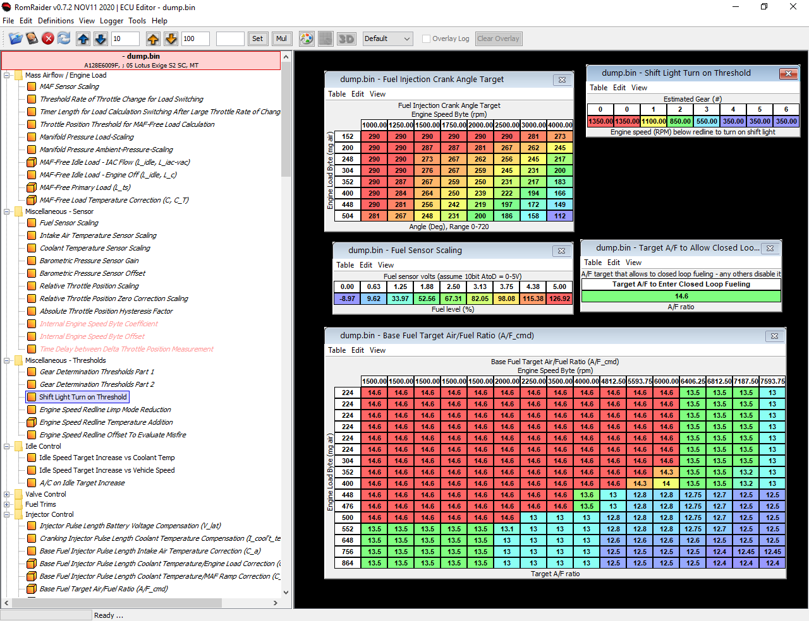

# Lotus T4e Flasher

## Disclaimer

***Use it at your own RISK.***

## Introduction

This is my attempt to tune my Lotus Exige S2 (T4e ECU White Dash).

It's heaveliy based on the work of [Obeisance] and [Cybernet].

[Obeisance]: https://www.lotustalk.com/threads/daft-disassembly.352193/
[Cybernet]: https://www.lotustalk.com/threads/t4e-ecu-editor-preview.372258/

I didn't have a Arduino with a CAN-Shield but I have an USB-to-CAN Adapter.
So I made my own Python-Script (Linux and Windows) to make the dump. It should also work
with a RaspberryPi and a CAN Hat (SocketCAN Driver).

After that I've realized that the Calibration ROM located at 0x10000 looks like
identical to the T4 ECU at address 0x70000. So I've edited the XML to use the
new offset.

But how to upload the modification back? Hum, after somes hours of disassembling,
I've figured out how to write to the RAM but not to the Flash.

Well If I can write to the RAM, I'am allowed to upload my own program. That's
what I've done. So I've write a small CAN-Bus Flasher to write to the Flash
through the OBD Port.

My final goal was to control my accusump with the T4e ECU, that was not possible
without patching the main program. See folder [accusump].

To be able to patch the main program more safely I've includer the flasher into
the bootloader. See folder [stage15].

[accusump]:https://github.com/Alcantor/LotusECU-T4e/tree/master/accusump
[stage15]:https://github.com/Alcantor/LotusECU-T4e/tree/master/stage15

## Licensing

Under [CC-NC-SA].

[CC-NC-SA]: https://creativecommons.org/licenses/by-nc-sa/4.0/

## Factory Method

The T4e ECU on the Lotus with white dashboard (Instrument Cluster) has a
bootloader which is capable of reprogramming the ECU through the OBD port with
the old K-Line protocol. It's slow, complicated and not really reliable (I
assume that's not reliable because BOE doesn't support that method anymore).
If you want to flash using that method, try the [Daft_LotusT4_OBD].

The T4e of the black dashboard cars has another bootloader which does the
reprogramming with CAN-Bus (500 kbit/s).

For the white dashboard at least (black dashboard?), there is an access provided
by the main program trough CAN-BUS (1 Mbit/s). It's not intended for
reprogramming the ECU, but with somes hacks it could be use for this purpose.

My little hack is not guaranteed to work on all software versions of the
ECU but when it works it's very reliable (A good CAN-Bus adapter is mandatory).

If you want more information about the protocol used by the factory bootloader,
if you want to try it on a black dashboard or if the hack doesn't work,
please contact me.

[Daft_LotusT4_OBD]: https://github.com/Obeisance/Daft_LotusT4_OBD

## Prerequisite

The [Python 3] interpreter with the [python-can] module and a compatible [CAN-BUS adapter].

The CANable is very simple to use, but it has a bottleneck with the serial interface,
and does not work well with the "t4e.py" script. In contrario the "flasher.py" works
flawless (but slowly) with this adapter because it doesn't make bulk read/write. So
if you still want to use this adapter, use the download function of the "flasher.py"
and not from the "t4e.py".

The IXXAT USB-to-CAN Adapter is easy to use and reliable but expensive.

The Raspberry-Pi + CAN-Hat is cheap and reliable but more complicated to use (And
you can use it as a BDM-Programmer).

[Python 3]: https://www.python.org/download/releases/3.0/
[python-can]: https://python-can.readthedocs.io/en/master/installation.html
[CAN-BUS adapter]: https://python-can.readthedocs.io/en/master/interfaces.html

## Files

 Files                 | Description
 ----------------------|------------
 t4e.py                | Program to talk to the original Software (Read/Write RAM)
 flasher.py            | Program to talk to the flasher Software (Read/Write RAM+Flash+EEPROM)
 flasher/*.bin         | CAN-Bus Flasher for the MPC563
 gui.py                | Graphical interface for both t4e.py and flasher.py
 sign.py               | Tool for CRC
 bdm-pi.py             | MPC5xx BDM Bit-Banging Tool for the Raspberry Pi

## Command line example (OBD Port)

    1. sudo ip link set can0 up type can bitrate 1000000
    2. ./t4y.py -o dl -z 0 1 2 3 4
    3. cp calrom.bin calrom.ori.bin
    4. [Modify calrom.bin with RomRaider]
    5. ./sign.py sign_calrom calrom.ori.bin calrom.bin calrom.bin "MYTUNE"
    6. ./t4e.py -o ifp
    7. ./flasher.py -o vfp
    8. ./flasher.py -o e -b 1
    9. ./flasher.py -o vb -b 1
    10. ./flasher.py -o p -b 1
    11. ./flasher.py -o v -b 1
    12. ./flasher.py -o r

    To 1: Turn CAN-Bus on [Linux/SocketCAN Only]
    To 2: Download the ECU like cybernet does.
    To 3: Backup, backup, backup...
    To 4: Tune your engine!
    To 5: Sign the calibration with a fake date to match the original CRC. **
    To 6: Install the flasher into the RAM. *
    To 7: Verify the flasher itself.
    To 8: Erase the calibration block. *** [TESTED] ***
    To 9: Verify the erasure.
    To 10: Program the calibration block. *** [TESTED] ***
    To 11: Verify the calibration block.
    To 12: Reset.

*: This use a little hack (Stack Overwrite) to gain control, retry 4-5 times if it fails.

*: Tested with "BCroftT4E070 01/11/2005 Lotus EngV0078", "BCroftT4E090 14/07/2006 Lotus EngV0091" and "BCroftT4E090 14/07/2006 Lotus EngV0093" yet.

**: Old version like "BCroftT4E070 01/11/2005 Lotus EngV0078" does not check the CRC at all.

## Live tuning.

It's possible to make modifications on running engine for test, because the
maps are copied into the RAM.

It would need another software for that, which will use t4e.py as library to
access RAM.

## Safe Usage

You really need to understand how this work to be able to use the flasher
(flasher.py) safely.

 1. The RAM will be lost at power cut off or reset.
 2. The flasher needs to be installed in RAM.
 3. To install the flasher in the RAM, the Main Program is needed.
 4. To start the Main Program, a Bootloader is needed.

So if you erase the Main Program and cut the power off, don't expect to be able
to restore your ECU with that program through the OBD port. You will have to
save your ECU with the programming (BDM) port on the board.

Use the verify function before resetting the ECU! If your programming a Bootloader
or a Main Program, be sure that the files are good and valid.

*Note: The Main Program seems to be OK without Calibration.*

## GUI

The simple GUI...

## RomRaider

You have to open the "calrom.bin" file of your dump.

## Command line example (BDM Port)

If your ECU is completely fucked up, or unsupported by the t4e.py script (T4e/T6e ECU Black Dash ?),
you could use the BDM port with a Raspberry Pi. It's much slower than a true BDM-Programmer but
if you have a Raspberry Pi laying around, why not.

For that you need to remove you ECU from your car, open it and connect it correctly. It's only
loading the CAN-Bus Flasher with the BDM Port, so you also need to wire a CAN-Bus adapter.

Those commands are for the Raspberry Pi with a CAN Hat.

    1. ./bdm-pi.py -o pdh
    2. [TURN YOUR ECU ON]
    3. ./bdm-pi.py -o t
    4. ./bdm-pi.py -o ufp
    5. ./flasher.py -o b &
    6. ./bdm-pi.py -o sfp
    7. ./flasher.py -o dl

    To 1: Drive the DSCK pin high to enter BDM mode.
    To 2: Turn the CPU on.
    To 3: Test the connection by writing/reading a word. If it fail check your connections.
    To 4: Upload the flasher into the RAM.
    To 5: Bootstrap: The CAN-Flasher needs a answer within a short time, otherwise it will exit.
    To 6: Start the flasher.
    To 7: Download the ECU for example.
