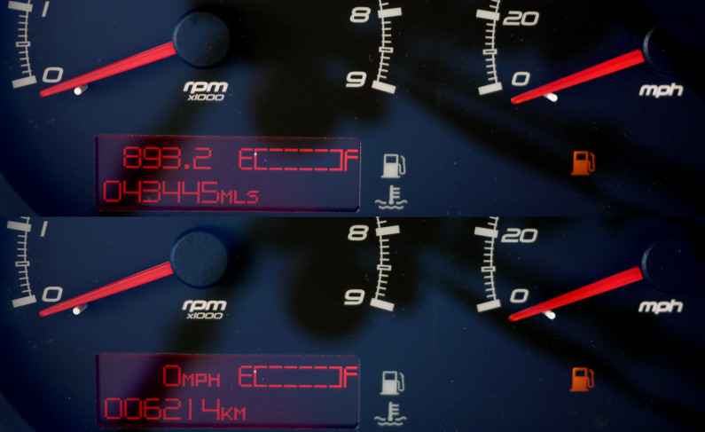
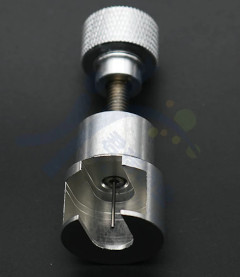
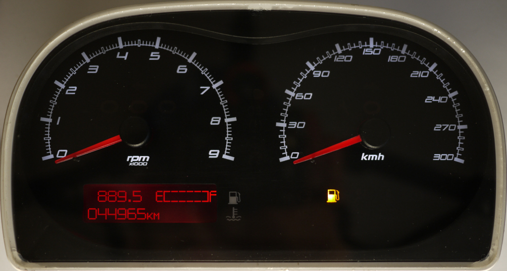
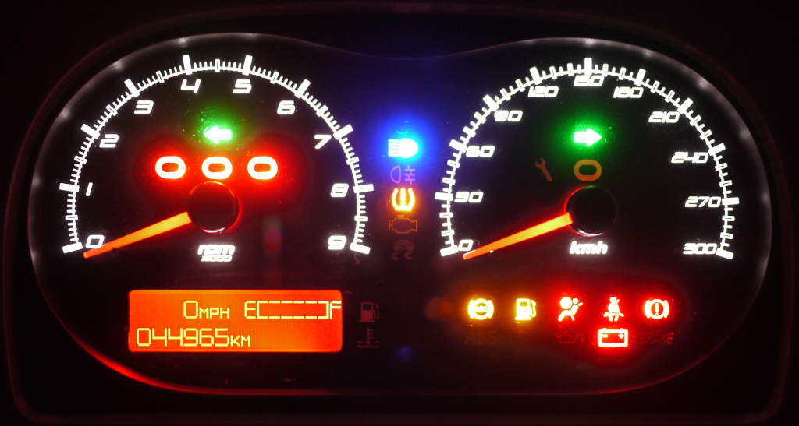

# My Black-Cluster Test Bench

## Minimal connections

	A2 - GND
	A3 - BATT - 12V
	A5 - IGN - 12V
	B8 - KEY IN - 12V

	A7 - CAN High
	B7 - CAN Low

To connect it into my 2007 (non-airbag) car, I have used an adapter sold normally for the AIM Dash. I didn't get power on PIN B8, and so I've bridged A5 and B8.

## Power consumption

About 300 mA (with backlight)

## Conversion of the LCD display from Miles to Kilometers

In the black cluster from 2008 to 2011, to change the display unit, the software
must be changed. It's not a configuration of the EEPROM.



## Conversion of the gauges face from Miles to Kilometers

Gauges face from [heiler-tachodesign]. You will need a needle puller to swap the gauge.







[heiler-tachodesign]: https://www.heiler-tachodesign.de/

## EEPROM Data

The Cluster does nothing if the EEPROM does not contain any configuration.

A mileage entry into the EEPROM makes 32 bytes.
There are 10 entries located at 0x900 + 32 * x (where x is 0-9).

	struct entry{
		uint32_t odo_normal;
		uint32_t odo_invert;

		uint16_t odo100th_normal;
		uint16_t odo100th_invert;

		uint32_t trip_normal;
		uint32_t trip_invert;

		uint16_t trip100th_normal;
		uint16_t trip100th_invert;

		uint32_t unknow_normal;
		uint32_t unknow_invert;
	}

## Usage Tip: UsbdmMemoryDump

Write into register 0x12 the value 0x09 (EEPROM at location 0x800)
to enable the EEPROM like the software does it.

Initialization: (12,09)

PPAGE Register Address: 0x30

	   800     FFF 2 <- EEPROM
	  1800    3FFF 2 <- RAM
	  4000    7FFF 2 <- Flash Page 0x3E (Copy)
	  C000    FFFF 2 <- Flash Page 0x3F (Copy)

	308000  30BFFF 2 <- Flash Page 0x30
	318000  31BFFF 2
	328000  32BFFF 2
	338000  33BFFF 2
	348000  34BFFF 2
	358000  35BFFF 2
	368000  36BFFF 2
	378000  37BFFF 2
	388000  38BFFF 2
	398000  39BFFF 2
	3A8000  3ABFFF 2
	3B8000  3BBFFF 2
	3C8000  3CBFFF 2
	3D8000  3DBFFF 2
	3E8000  3EBFFF 2
	3F8000  3FBFFF 2 <- Flash Page 0x3F

## Usage Tip: srec_cat

```
srec_cat full.s19 -fill 0xFF 0x0 0x3FC000 -o full.bin -binary
srec_cat full.s19 -fill 0xFF 0x0 0x3FC000 -offset -0x800 -crop 0x0 0x800 -o eeprom.bin -binary
for i in {3178496..4161536..65536}; do srec_cat full.s19 -fill 0xFF 0x0 0x3FC000 -offset -$i -crop 0x0 0x4000 -o f$i.bin -binary; done
srec_cat full.s19 -crop 0x308000 0x3FC000 -o flash.s19
```

## Usage Tip: UsbdmScript

```
settarget HCS12
setdevice MC9S12HZ256
openbdm

# Prepare EEPROM
wb 0x12 0x9

# Example erase EEPROM word 0x820 (0x40 is sector erase and 0x41 is mass erase)
ww 0x820 0xFFFF
wb 0x116 0x40
wb 0x115 0x80

# Example write EEPROM word 0x820
ww 0x820 0x2400
wb 0x116 0x20
wb 0x115 0x80
```

