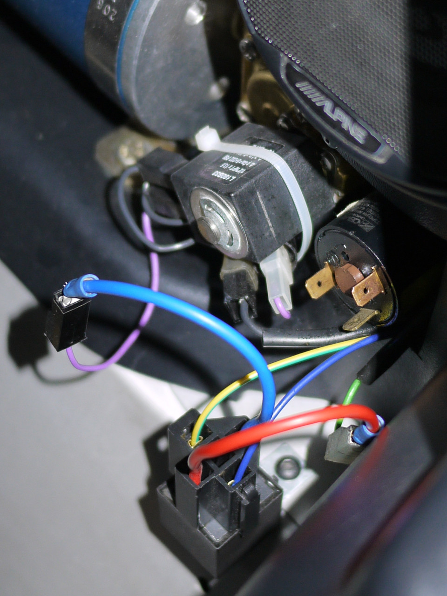

## Introduction

The accusump typically comes with a pressure switch, which means the threshold
is fixed. However, with hot oil and the engine idling, the oil pressure often
drops below this threshold, causing the accusump to falsely empty. To ensure a
full charge for the next engine start, I would have to rev the engine just
before shutting it down. Not really good.

One solution is to implement a variable threshold to open the accusump based on
RPM.

Finally, I realized that I could use the ACIS airbox flap output from the ECU to
control my accusump.

## Hardware

 1. Replace the original oil pressure switch with an analog one.
 2. Install a new relay (SPST NO) on the ACIS airbox flap output (Sumitomo plug).
 3. Connect the accusump solenoid to the relay output.

The original oil pressure switch only have one wire for the signal. Analog
oil pressure sensor often needs a GND and a 5 Volts wires, the 5 Volts could be
from your separate gauge, or from another sensors (MAP, TPS or MAF).

***Note***: The oil pressure input is calibrated for a 3 wire and 0-10 bar
(150 psi) sensor.

## Hardware Specifications

 - The selenoid of the accusump needs 600 mA to hold the valve opened.
 - The selenoid has a too big inrush current for the driver (L9822E).
 - The driver (L9822E) of the T4e can provide 750 mA continuously and 1050 mA
   for high inrush currents.
 - The driver (L9822E) has a short circuit protection.
 - The standard oil pressure switch fo the car has a threshold at 0.2 bar.

***It's not possible to connect directly the ACIS output to the accusump.
A relay is needed.***

## Queries

 - Oil Pressure: OBD mode 0x22 pid 0x0402

## Pictures

