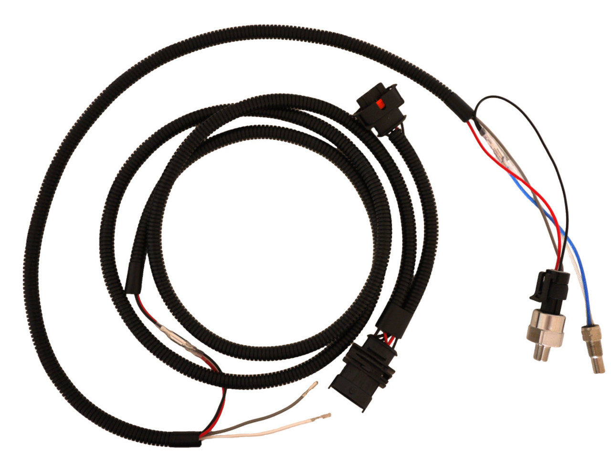
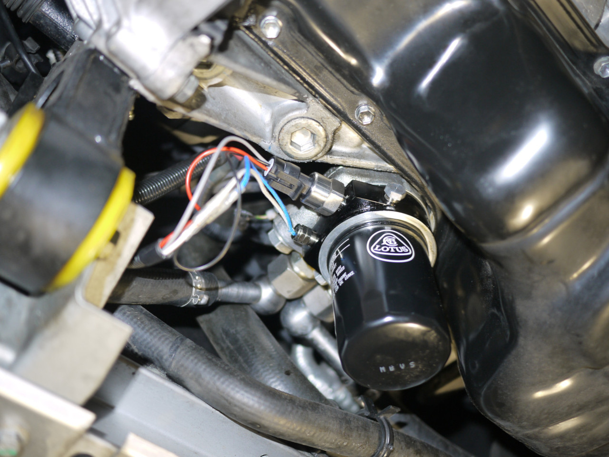
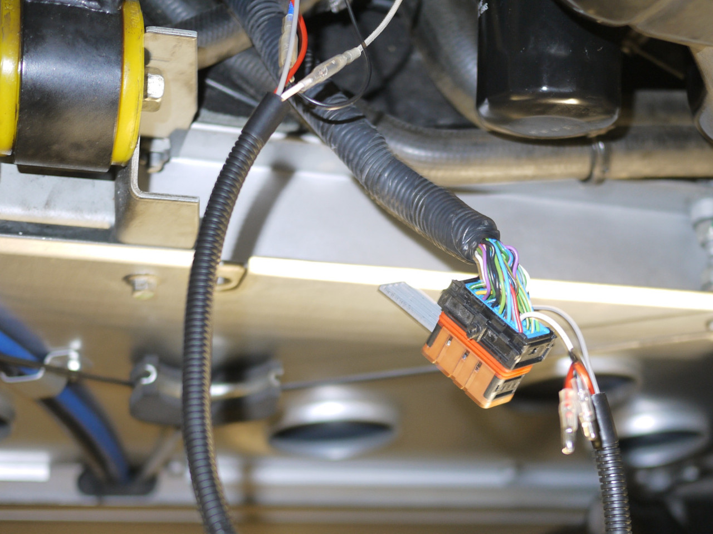
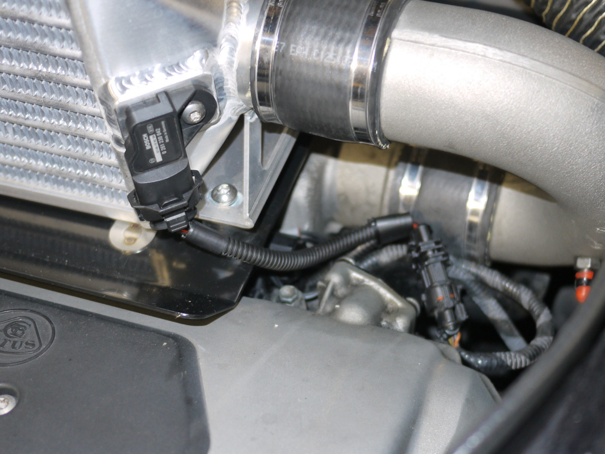

## Introduction

This patch allows adding oil pressure and oil temperature for the OBD interface.

As a bonus, it also adds the missing intake manifold absolute pressure (Exige).

## Hardware

 1. Add an oil pressure sensor on the PIN LE4.
 2. Add an oil temperature sensor on the PIN LD3.
 3. Source 5V and ground signals, such as from the MAP sensor.

***Note***: The oil pressure input is calibrated for a 3 wire and 0-10 bar
(145 psi) sensor.

***Note***: The oil temperature input is calibrated for a NTC 53k (at 25°C) and
Beta 3940.

## Queries

 - Oil Pressure: OBD mode 0x01 pid 0x0A (Fuel Pressure)
 - Intake Manifold Pressure: OBD mode 0x01 pid 0x0B
 - Oil Temperature: OBD mode 0x01 pid 0x5C

## Pictures

