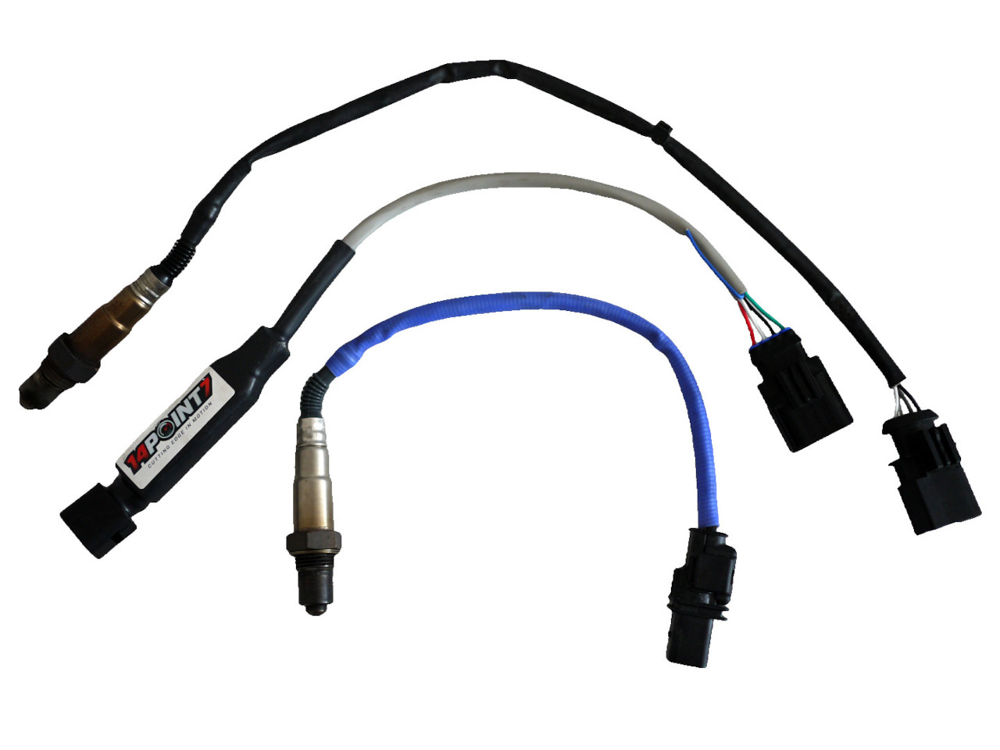

## Introduction

This is to replace the Pre-O2 sensor with a Wideband O2.

The AFR will be available on OBD interface but internally the ECU will
transform the wideband signal into a narrow signal and it will continue
to work as if the Pre-O2 would be a narrow one.

## Hardware

 1. 14point7 Spartan 2 wideband controller.
 2. Kostal 09 3414 01 plug.

***Note***: The heater ground will be turned on only when the engine is started.

## Queries

 - Lambda: OBD mode 0x01 pid 0x24

## Pictures

