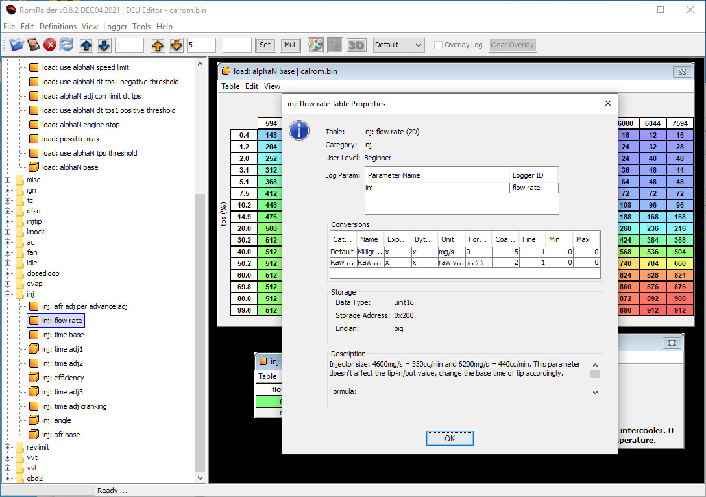

## Introduction

To edit the "calrom.bin" files in RomRaider a definition file is required.

It's also possible to open the "decram.bin" file to show some learned data.

The T4e RomRaider definition is very complete and avalaible for free. For the
T6 definition please contact me.

## Usage

The "T4E90_defs.xml" file was created for a 2008 T4e ECU. It should also work
with 2006–2007 ECUs, but for best results, update your software to the latest
version.

Read the description of the tables:

