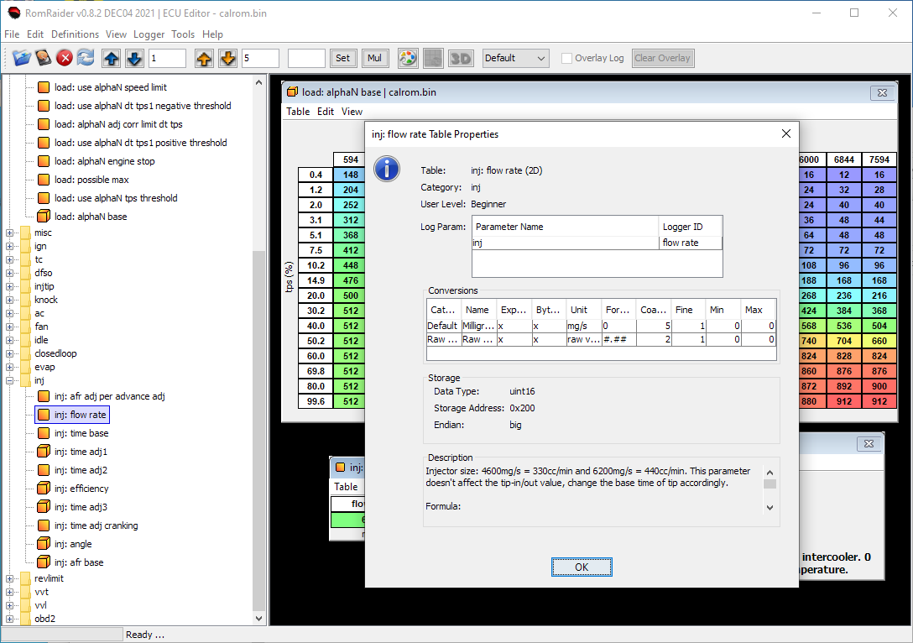

## Introduction

To edit the "calrom.bin" files in RomRaider a definition file is required.

It's also possible to open the "decram.bin" file to show some learned data.

The T4e RomRaider definition is very complete and avalaible for free. For the
T6 definition please contact me.

## Usage

The "T4e_defs.xml" was made for a 2008 T4e ECU. It should also work for 2006-2007
ECUs but some errors may appear.

Read the description of the tables:

